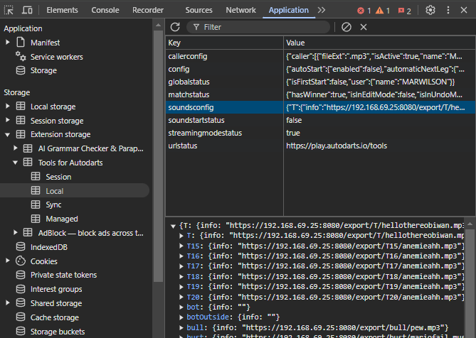

# Local MP3 Server for AutoDarts Soundboard 🎯

## Important Notes ❗
- **Security** 🔒 Only use this script on a secure local network to prevent unauthorized access to your MP3 files.
- **Not completly tested** 🧪 This script is still in development and may have bugs or issues.
- **Hobby Project** 🎨 This Project was quickly programed and is not optimized for performance or scalability.
- **No Support** 🚫 This script is provided as-is without any guarantees or support. Use at your own risk.  

## Introduction 💡

This project provides a local MP3 server for use with the [Tools for AutoDarts Chrome Extension](https://chromewebstore.google.com/detail/tools-for-autodarts/oolfddhehmbpdnlmoljmllcdggmkgihh). The extension allows users to set custom sounds for specific events in AutoDarts by either uploading MP3 files or providing direct URLs to them.&#x20;

### The Problems 🚫

1. **Limited File Uploads** 📂 – Uploading MP3 files directly is restricted in size and number.
2. **Unclear File Links** 🔗 – Using URLs often results in cryptic links that don't indicate the content of the MP3 file.
3. **Inconsistent Volume Levels** 🔊 – Some online MP3 files are too loud, while others are too quiet.
4. **Silence at the Beginning** 🔕 – Many MP3s have unwanted silence at the start, causing delayed playback (e.g., hearing a sound 3 seconds after hitting a triple 20).
5. **No Import Functionality** 📥 – Setting up a lot of MP3s of work (posting every link into the fields). 
This is problematic, if your audio configs get lost, for example extension was disabled by accident. Also setting up the same soundboard on another device takes long after installing the extension there. 

### The Solution ✅

To address these issues, this Python script was developed using Flask, Watchdog, and Pydub. It provides:

1. **A Local MP3 Server** 🖥️ – Host MP3 files on a local device (PC, Raspberry Pi, etc.) to serve them via a structured URL.
2. **Unlimited Storage** 💾 – Store as many MP3s as the device allows without any upload limitations.
3. **Clear URL Structure** 🌐 – Example: `http://localhost:8080/triple/cheer.mp3`, making it easy to identify sounds.
4. **AutoIndex UI** 📜 – Browse MP3 files via a simple web interface.
5. **Independent Input & Output Folders** 📁 – Place MP3s into `audio_input`, and they will be processed into `audio_output`.
6. **Volume Normalization** 🎚️ – Ensures all MP3s play at a consistent volume.
7. **Automatic Silence Trimming** ✂️ – Removes leading silence so sounds play instantly.
8. **Export Functionality** 📤 - Download MP3 files link as json config for the Autodarts Tools extension.
This maks it possible to import the soundboard to another device or restore it after a reinstall of the extension by inserting them into the browsers local storage. 

---

## Installation 📥

### Download the Repository 📦

1. **Install Git** 🐙

   Download and install Git from [git-scm.com](https://git-scm.com/downloads).

1. **Clone the Repository** 📂

   Use Git to clone the repository to your local device:
    ```sh
    git clone https://github.com/milomarv/AutodartsMP3SoundboardServer.git
    ```

1. **Navigate to the Directory** 📁

   Move into the project folder:
    ```sh
    cd AutodartsMP3SoundboardServer
    ```

### Update the Repository 🔄
- **Pull the Latest Changes** ⬇️

    If you have already cloned the repository, you can update it with the latest changes:
    ```sh
    git pull
    ```

### Windows Installation 🖥️

1. **Install Python** 🐍

   - Download and install Python from [python.org](https://www.python.org/downloads/).
   - Ensure `pip` is installed and added to the system PATH.

2. **Set Up a Virtual Environment** 🛠️
    
    Build a virtual environment to keep dependencies isolated.

    ❗ **ONLY THE FIRST TIME** ❗
    ```sh
    python -m venv venv
    ```

    Activate the virtual environment.

    ▶️ **Every Time You start the script** ▶️
    ```sh
    .\venv\Scripts\activate
    ```

3. **Install Required Packages** 📦

    ❗ **ONLY THE FIRST TIME** ❗
   ```sh
   pip install -r requirements.txt
   ```

4. **Run the Script** 🚀

   ```sh
   python audio_mp3_server.py
   ```

### Linux / Raspberry Pi Installation 🐧

1. **Install Dependencies** 🔧

   ```sh
   sudo apt update && sudo apt install python3 python3-pip ffmpeg -y
   ```

2. **Set Up a Virtual Environment** 🛠️

    Build a virtual environment to keep dependencies isolated.

    ❗ **ONLY THE FIRST TIME** ❗
    ```sh
    python3 -m venv venv
    ```

    Activate the virtual environment.

    ▶️ **Every Time You start the script** ▶️
    ```sh
    source venv/bin/activate
    ```

2. **Install Required Python Packages** 🐍

    ❗ **ONLY THE FIRST TIME** ❗
   ```sh
   pip3 install -r requirements.txt
   ```

3. **Run the Script** 🚀

   ```sh
   python3 audio_mp3_server.py
   ```


### Adding first MP3 files 🎵
1. **Initialize Script** 🚀
    In order to make the `audio_input` folder visible in your file explorer, you need to start the script first.
    ```sh
   python3 audio_mp3_server.py
   ```
   Stop the script with `CTRL + C` after the server is running.

2. **Add MP3 files** 🎵
    Place your MP3 files in the `audio_input` folder. The script will automatically process them and move them to the `audio_output` folder.

---

## Accessing the MP3 Server UI 🔗

Once the script is running, open a browser and go to:

```
http://localhost:8080/
```

## Enable HTTPS for different devices in the same network 🌐

❗**Problem:** If you want to access the server from a different device in the same network, you need to replace `localhost` with the IP address of the server. However, this can cause issues with the browser blocking the connection due to security concerns.

### Get your IP address in the local network 🌐

   - **Windows:** 🖥️ Run `ipconfig` in Command Prompt and find `IPv4 Address`.
   - **Linux / Raspberry Pi:** 🐧 Run `hostname -I` in the terminal.

### Install OpenSSL 🛠️

   - **Windows:** 🖥️ Download and install [OpenSSL](https://slproweb.com/products/Win32OpenSSL.html).
   - **Linux / Raspberry Pi:** 🐧 Run `sudo apt install openssl`.
   
   Ensure `openssl` is added to the system PATH:
   ```sh	
   openssl version
   ```

### Generate a Self-Signed Certificate 🛡️

   Run the following command to generate a self-signed certificate:
   ```sh
   openssl req -newkey rsa:2048 -nodes -keyout key.pem -x509 -days 365 -out cert.pem
   ```

   There will be a series of prompts to fill in. You can skip most of them by pressing `Enter`.

   This will create `key.pem` and `cert.pem` files.

### Start the Server with HTTPS 🚀

   If `key.pem` and `cert.pem` are in the project directory, the script will automatically use HTTPS.
   
   ```sh
   python audio_mp3_server.py
   ```

### Access the Server 🌐

   Open a browser on the other device and go to:
   ```
   https://<IP_ADDRESS>:8080/
   ```

   Replace `<IP_ADDRESS>` with the IP address of the server.

   You may need to accept the security warning in the browser to proceed. Just click on `Advanced` and `Proceed`.

## Setup autostart on boot 🚀

### Windows 🖥️

1. **Create a Batch File** 📄

   Create a new text file with the following content:

   ```batch
   @echo off
   cd /d "C:\path\to\project"
   call venv\Scripts\activate
   python audio_mp3_server.py
   ```

   Replace `C:\path\to\project` with the actual path to the project folder.

2. **Add to Startup Folder** 📂

   - Press `Win + R` and type `shell:startup`.
   - Move the batch file into the folder that opens.

### Linux / Raspberry Pi 🐧

1. **Create a Service File** 📄

   Create a new service file:

   ```sh
   sudo nano /etc/systemd/system/mp3_server.service
   ```

   Add the following content:

   ```ini
   [Unit]
   Description=MP3 Server
   After=network.target

   [Service]
   Type=simple
   ExecStart=/path/to/project/venv/bin/python /path/to/project/audio_mp3_server.py
   WorkingDirectory=/path/to/project
   Restart=always
   RestartSec=3

   [Install]
   WantedBy=multi-user.target
   ```

   Replace `/path/to/project` with the actual path to the project folder.

1. **Reload `systemd` and enable the Service** 🔄

   Reload the `systemd` daemon:

   ```sh
   sudo systemctl daemon-reload
   ```

   Enable the service to start on boot:

   ```sh
   sudo systemctl enable mp3_server.service
   ```

1. **Start the Service** 🚀

   Start the service:

   ```sh
   sudo systemctl start mp3_server.service
   ```

1. **Check the Service Status** 🕵️

   If you want to check the status of the service:

   ```sh
   sudo systemctl status mp3_server.service
   ```

   Can also be checked after rebooting the device.

---

## JSON Export Functionality 📤

The script provides a JSON export functionality to download the MP3 files as a configuration file for the AutoDarts Tools extension. This allows you to import the soundboard to another device or restore it after a reinstall of the extension by inserting them into the browser's local storage.

### Setup Export 🛠️

You will need to save your MP3 files in a specific format to export them correctly. Therefore you can find a template in the `audio_input/export` folder. This contains subdirectories for every type of sound the Autodarts Tools extension supports.

### Placing Files Correctly 📂

In every subdirectory is a `.txt` file which describes how the MP3 files should be placed in it and what it is used for. There are different rules for every type of sound.

- **Single Sounds** 🎵 - In some directories only one MP3 file is supportet.
If you place more than one MP3 file in the directory, only the first one will be exported.
- **Multiple Sounds (Miss Sounds)** 🚫 - In this directories multiple MP3 files are supported.
- **Sounds with Meta Data (Win Sounds)** 🏆- In this directory the MP3 file name contains the Meta Data. 
This means MP3 files have to be saved by a specific naming convention.
The `details.txt` will tell you how to name the files.

### Generating the JSON File 📤
You can generate the JSON by accessing this link in your browser:
```sh
http://localhost:8080/export_json
```
If folders are empty it will just generate an empty field for this sound type.

### Importing the JSON File into the AutoDarts Tools Extension 🔼
This part is a little bit tricky as there is no import functionality in the extension itself. You have to follow these steps to import the JSON file:

1. **Open the Extension Page** 🌐
   Open the AutoDarts Tools extension page in your browser:
   ```
   https://play.autodarts.io/tools
   ```

2. **Open the Developer Console** 🛠️
   Press `F12` to open the developer console.

3. **Find the Local Storage for Sounds** 📦
   - Go to the `Application` tab and select `Extension Storage` on the left side.
   - There navigate to `Extension Storage > Tools for AutoDarts > Local`.
   - This will open some key value pairs on the right side.
   - Find the key `soundconfig`, this contains your sound setup.

   

4. **Insert the JSON Content** 📤
   - Right-click on the value field of the `soundconfig` key and select `Edit value`.
   - You can now paste the content of the JSON file into the value field and press `Enter`.

5. **Finish the Import** 🎉
   - Close the developer console and refresh the page.
   - Your soundboard should now be imported.

---

## How the Code Works 🔍

### MP3 Server Constants 🔢

At the beginning of the `audio_mp3_server.py`, these constants define key configurations:

```python
INPUT_DIRECTORY = 'audio_input'  # Folder for unprocessed MP3s
OUTPUT_DIRECTORY = 'audio_output'  # Folder for processed MP3s
PORT = 8080  # The server port
SILENCE_THRESHOLD = -50.0  # dB level for silence detection
CERT_FILE = 'cert.pem'  # SSL certificate file
KEY_FILE = 'key.pem'  # SSL key file
```

You can adjust these values if needed, for example:

- **Change the server port** 🔄 if `8080` is already in use.
- **Modify the silence threshold** 🎚️ if silence trimming is too aggressive or not aggressive enough.

### Export Constants 📦

```python
EXPORT_FOLDER = 'export'  # Folder for exporting MP3s
```

This constant defines the folder where MP3 files can be exported from the server. This is useful for downloading MP3s to upload them into the AutoDarts Tools local storage.

### Main Components 🔧

- **Flask Server** 🌐 – Hosts MP3 files with AutoIndex UI.
- **Watchdog** 👀 – Detects new MP3 files in `audio_input` and automatically processes them.
- **Pydub Processing** 🎛️ – Trims silence, normalizes volume, and moves the MP3 to `audio_output`.

### Running the Server 🚀

Activate the virtual environment:
```sh
.\venv\Scripts\activate  # Windows
source venv/bin/activate  # Linux / Raspberry Pi
``` 

Then execute:

```sh
python audio_mp3_server.py
```

Once running, the server will:

1. **Scan** `audio_input`  process any MP3 files.
2. **Normalize their volume** 🎚️ – Ensure consistent audio levels.
3. **Save them in** `audio_output`  so can be acessed via the browser.
4. **Watch for new or removed files** 👀 – Update accordingly.

---

## Conclusion 🎯

This script provides a powerful and flexible way to manage MP3 sounds for AutoDarts, solving the limitations of file uploads and cryptic URLs. By hosting files locally, you get unlimited storage, better organization, and consistent audio quality. 🚀

For any issues or improvements, feel free to contribute or modify the script as needed! ✨


